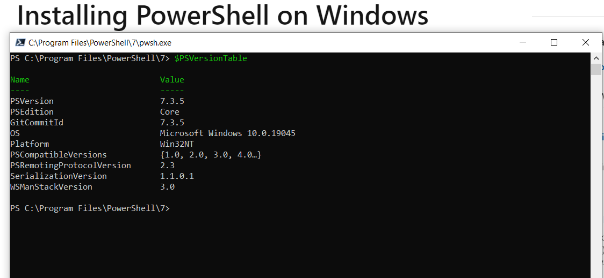
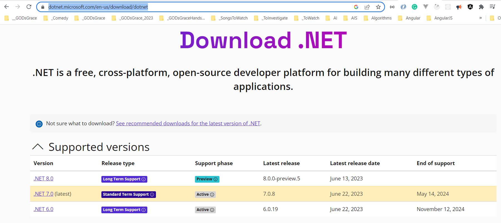
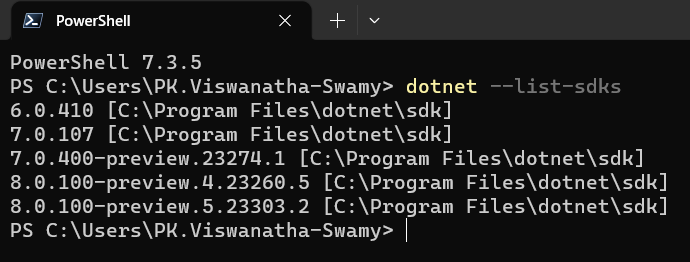
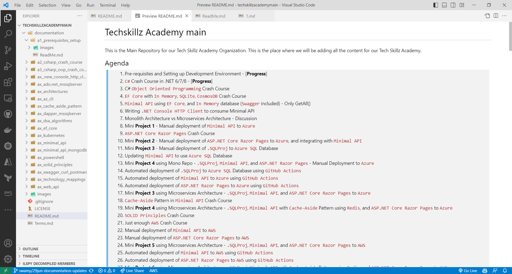
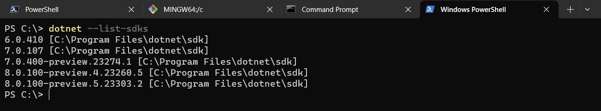
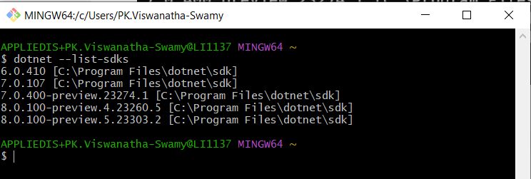
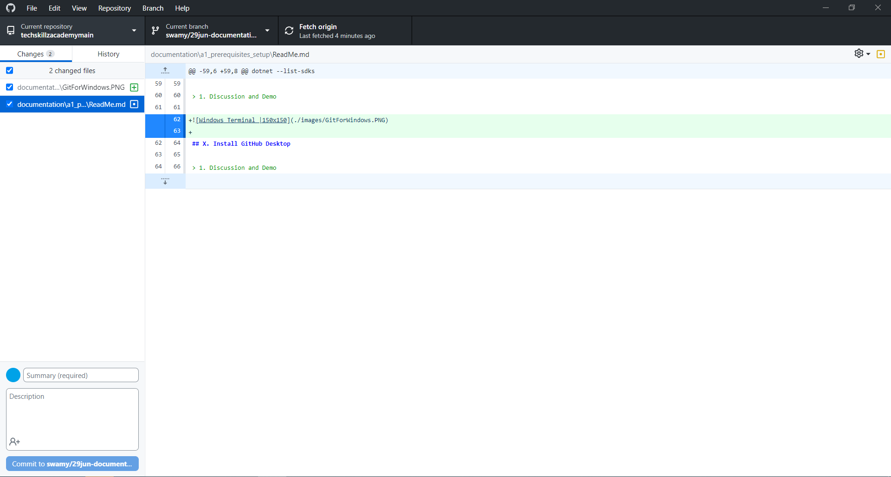

# Pre-requisites and Setup

## Date: XX-XXX-2023

---


## 1. Pre-requisites and Setting up Development Environment

> 1. Install PowerShell Core 7.3 or above
> 1. Install .NET 6/7/8 SDKs
> 1. Install Visual Studio Code
> 1. Install Windows Terminal
> 1. Install Git for Windows
> 1. Install GitHub Desktop

## 2. Install PowerShell Core 7.3 or above

> 1. Install the PowerShell Core 7.3 or above from the URL below
> 1. Open PowerShell Core and run the command below to check the version of PowerShell Core

**Reference(s):**

> 1. [https://learn.microsoft.com/en-us/powershell/scripting/install/installing-powershell-on-windows?view=powershell-7.3](https://learn.microsoft.com/en-us/powershell/scripting/install/installing-powershell-on-windows?view=powershell-7.3)

```powershell
$PSVersionTable
```



## 3. Install .NET 6/7/8 SDKs

> 1. Install the .NET 6/7/8 SDKs from the URL below. Please refer the screenshots below of .NET Downloads and .NET SDKs
> 1. After installation, open PowerShell / CMD / Terminal and run the command below to verify the list of installed SDKs

**Reference(s):**

> 1. [https://dotnet.microsoft.com/en-us/download/dotnet](https://dotnet.microsoft.com/en-us/download/dotnet)

```powershell
dotnet --list-sdks
```





## X. Install Visual Studio Code

> 1. Discussion and Demo



## X. Install Windows Terminal

> 1. Discussion and Demo

```powershell
dotnet --list-sdks
```



## X. Install Git for Windows

> 1. Discussion and Demo



## X. Install GitHub Desktop

> 1. Discussion and Demo



---
