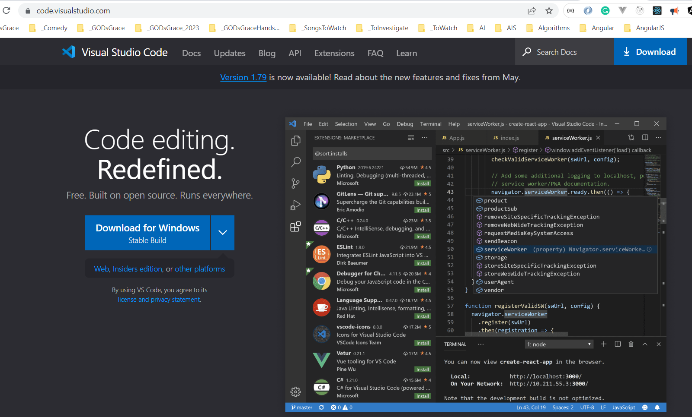
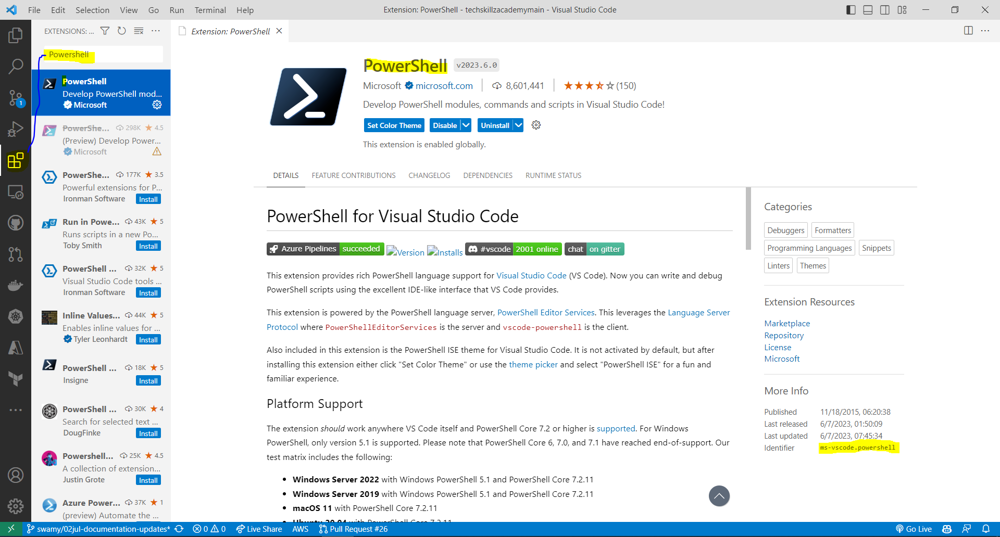

# Pre-requisites and Setup

## Date: XX-XXX-2023

---


## Pre-requisites and Setting up Development Environment

> 1. Install PowerShell Core 7.3 or above
> 1. Install .NET 6/7/8 SDKs
> 1. Install Visual Studio Code
> 1. Visual Studio Code Extensions
> 1. Install Windows Terminal
> 1. Install Git for Windows
> 1. Install GitHub Desktop

## 1. Install PowerShell Core 7.3 or above

> 1. Install the PowerShell Core 7.3 or above from the URL below
> 1. Open PowerShell Core and run the command below to check the version of PowerShell Core

**Reference(s):**

> 1. [https://learn.microsoft.com/en-us/powershell/scripting/install/installing-powershell-on-windows?view=powershell-7.3](https://learn.microsoft.com/en-us/powershell/scripting/install/installing-powershell-on-windows?view=powershell-7.3)

```powershell
$PSVersionTable
```


## 2. Install .NET 6/7/8 SDKs

> 1. Install the .NET 6/7/8 SDKs from the URL below. Please refer the screenshots below of .NET Downloads and .NET SDKs
> 1. After installation, open PowerShell / CMD / Terminal and run the command below to verify the list of installed SDKs

**Reference(s):**

> 1. [https://dotnet.microsoft.com/en-us/download/dotnet](https://dotnet.microsoft.com/en-us/download/dotnet)

```powershell
dotnet --list-sdks
```


## 3. Install Visual Studio Code

> 1. You can install Visual Studio Code from [https://code.visualstudio.com](https://code.visualstudio.com)
> 1. Install the version for your operating system. Please refer the screenshots below of Visual Studio Code Download and Visual Studio Code.




## 4. Visual Studio Code Extensions

> 1. Please install the following extensions in Visual Studio Code
>    - PowerShell
>    - C#
>    - MSBuild project tools

| Extension ID | Extension Name | Description |
| --- | --- | --- |
| ms-vscode.powershell | PowerShell | Provides PowerShell language and debugging support for Visual Studio Code. |
| ms-dotnettools.csharp | C# for Visual Studio Code (powered by OmniSharp) | C# editing support, including syntax highlighting, IntelliSense, Go To Definition, Find All References, debugging support for .NET, and support for csproj projects on Windows, macOS, and Linux. |
| tintoy.msbuild-project-tools | MSBuild project tools | Provides IntelliSense for MSBuild project files, including autocomplete for < PackageReference > elements. |



## X. Install Windows Terminal

> 1. Discussion and Demo

```powershell
dotnet --list-sdks
```


## X. Install Git for Windows

> 1. Discussion and Demo


## X. Install GitHub Desktop

> 1. Discussion and Demo


---

## X. To Do

### X. VS Code Extensions

> 1. ms-dotnettools.csharp
> 1. ms-dotnettools.dotnet-interactive-vscode
> 1. ms-toolsai.jupyter
> 1. tintoy.msbuild-project-tools
> 1. humao.rest-client
> 1. icsharpcode.ilspy-vscode
