# Microservices series - Session 1

## Date: XX-XXX-2023

## Agenda for this session

> 1. What is .NET?
> 1. .NET History
> 1. .NET CLR, BCL, CoreCLR, CoreFX basics
> 1. C# Language
> 1. Basic .NET CLI commands - Project Templates
> 1. Few Terms
> 1. `Global namespace imports` feature
> 1. `File-scoped namespaces` feature
> 1. Console Application with and without Top Level Statements
>    - 1.1 Without Top Level Statements
>    - 1.2 With Top Level Statements
> 1. Exploring Program Structure
> 1. Exploring Project Structure
> 1. SUMMARY / RECAP / Q&A
> 1. What is next ?

---


---

## 1. What is .NET?

> 1. .NET is a free, cross-platform, open source developer platform for building many different types of applications.
> 1. With .NET, you can use multiple languages, editors, and libraries to build for web, mobile, desktop, games, and IoT.
> 1. .NET is supported by Microsoft. Microsoft ships official releases that are built and tested on Microsoft-maintained servers in Azure and supported just like any Microsoft product.

## 2. .NET History

> 1. .NET Framework
> 1. .NET Core
> 1. .NET 5
> 1. .NET 6
> 1. .NET 7
> 1. .NET 8

## 1. Console Application with and without Top Level Statements

> 1. Discussion and Demo

### 1.1 Without Top Level Statements

```bash
dotnet new console -o demo1 --use-program-main
```

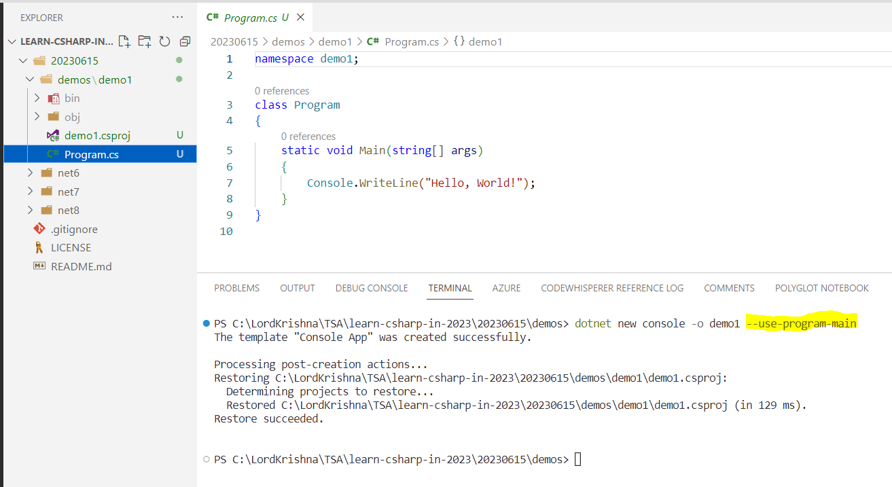

### 1.2. With Top Level Statements

> 1. Top level Statements, will create `Program` class, and `<Main>$()` method

```bash
dotnet new console -o demo2
```

```csharp
using System;
using System.Runtime.CompilerServices;

[CompilerGenerated]
internal class Program
{
    private static void <Main>$(string[] args)
    {
        Console.WriteLine("Hello, World!");
    }
}
```

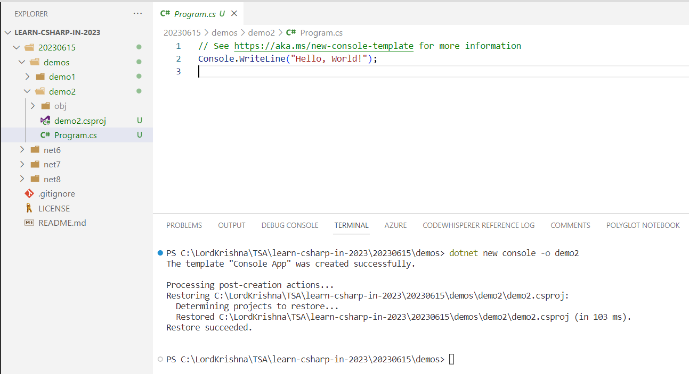

## 2. Creating a Console Application within an `Existing` and `New` folder

> 1. Discussion and Demo

### 2.1. Creating a Console Application within an `Existing` folder

> 1. Create a folder `existingfolder`
> 2. Open `cmd` and navigate to `existingfolder`
> 3. Run the below command
> 4. This will create a console application within the `existingfolder`
> 5. It will name the console application as `existingfolder`

```bash
dotnet new console
dotnet new console -n "projectName" -o .
```


### 2.2. Creating a Console Application within a `New` folder

> 1. Execute the below command
> 2. This will create a console application within the `newfolder`
> 3. It will name the console application as `newfolder`

```bash
dotnet new console -o newfolder
dotnet new console -n "projectName"
dotnet new console -n "projectName" -o folderName
```


## 3. Viewing `Compiler` Version and `Language` Version

> 1. Discussion and Demo

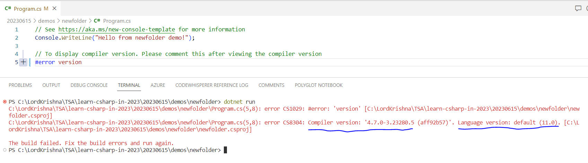

## 4. Creating a Console Application with different .NET (6/7/8)

> 1. Discussion and Demo

### 4.1. Creating a Console Application with different .NET 6

```bash
dotnet new console -o demo3 -f net6.0
```

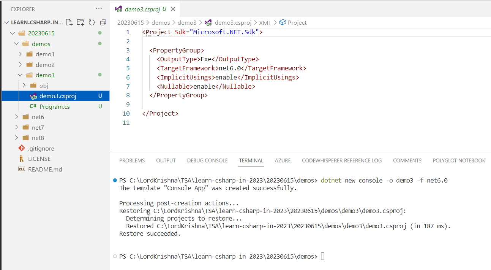

### 4.2. Creating a Console Application with different .NET 7

```bash
dotnet new console -o demo4 -f net7.0
```

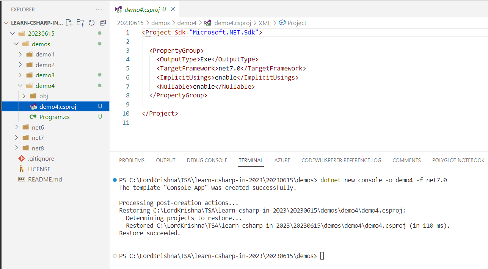

### 4.3. Creating a Console Application with different .NET 8

```bash
dotnet new console -o demo5 -f net8.0
```

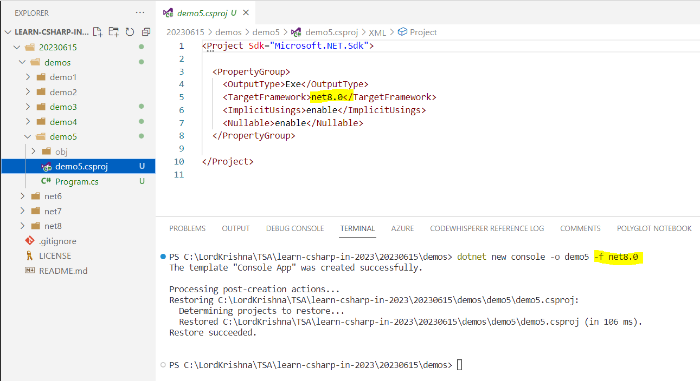

## 5. Creating a Console Application with global.json inside folder

> 1. Discussion and Demo
> 1. Execute the below command

```bash
dotnet new list

dotnet new globaljson --help

dotnet --list-sdks

dotnet new globaljson --sdk-version <VersionNumber> --dry-run
dotnet new globaljson --sdk-version <VersionNumber>
```

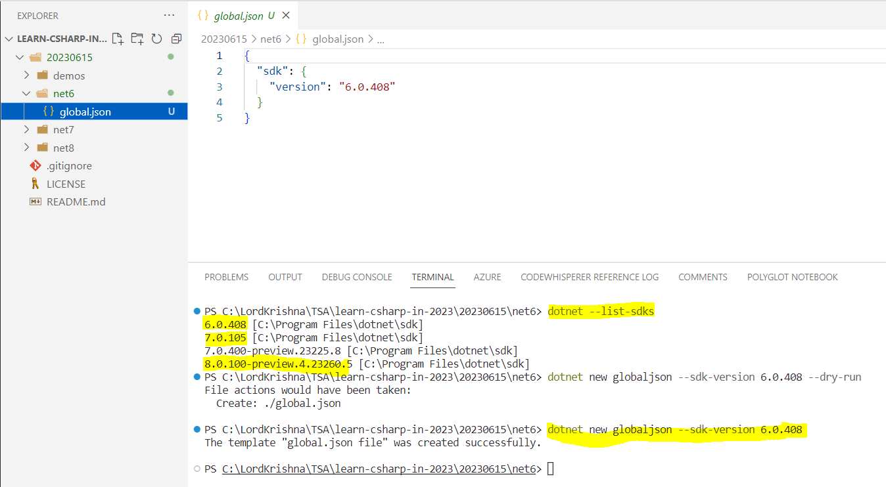

### 5.1. Creating a Console Application with different .NET 6

```bash
dotnet --list-sdks

dotnet new globaljson --sdk-version 6.0.408 --dry-run
dotnet new globaljson --sdk-version 6.0.408

dotnet new console -o demo6
```

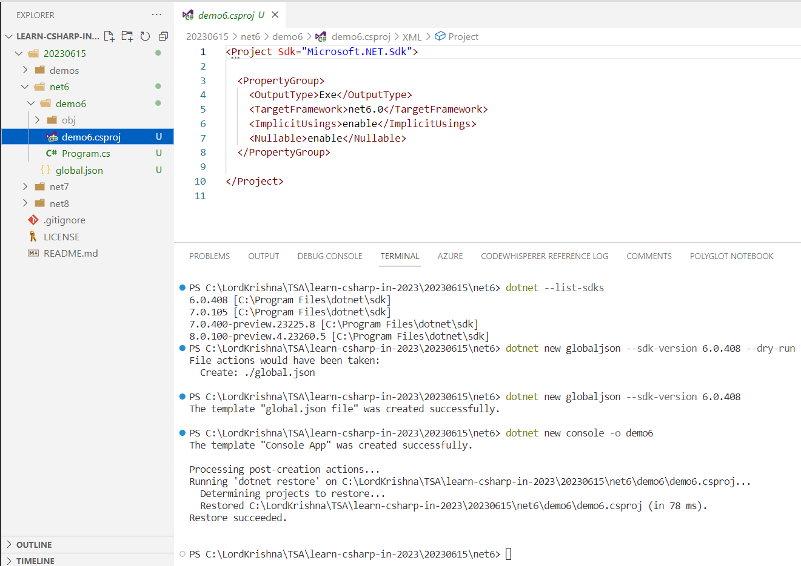

### 5.2. Creating a Console Application with different .NET 7

```bash
dotnet --list-sdks

dotnet new globaljson --sdk-version 7.0.105 --dry-run
dotnet new globaljson --sdk-version 7.0.105

dotnet new console -o demo7
```

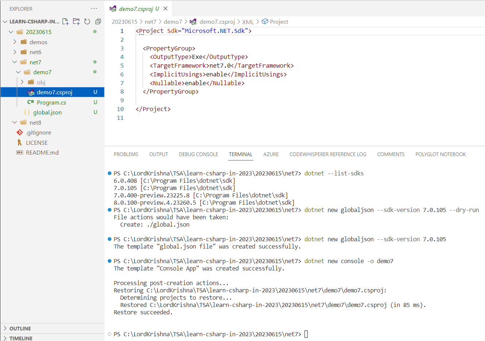

### 5.3. Creating a Console Application with different .NET 8

```bash
dotnet --list-sdks

dotnet new globaljson --sdk-version 8.0.100-preview.4.23260.5 --dry-run
dotnet new globaljson --sdk-version 8.0.100-preview.4.23260.5

dotnet new console -o demo8
```

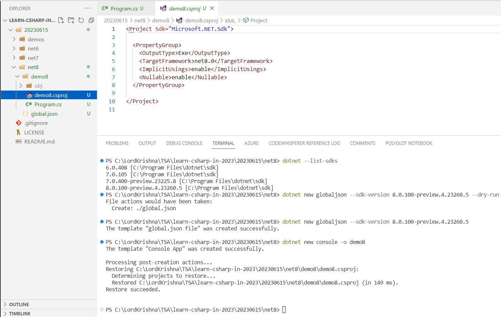

## 6. Executing the Same Application in .NET 6/7/8

> 1. Discussion and Demo
> 1. Copy and paste the below code in `Program.cs` file in 6/7/8 projects
> 1. Execute the project in 6/7/8
> 1. View the output

### 6.1. Sample C# Code

```csharp
// See https:// aka.ms/ new-console-template for more information
Console.ForegroundColor = ConsoleColor.Blue;

Console.WriteLine(Environment.CurrentDirectory);
Console.WriteLine(Environment.OSVersion.VersionString);
Console.WriteLine(Environment.Version);
Console.WriteLine(Environment.UserName);
Console.WriteLine(Environment.MachineName);
Console.WriteLine(Environment.ProcessorCount);
Console.WriteLine(Environment.SystemDirectory);
Console.WriteLine(Environment.UserDomainName);
Console.WriteLine(Environment.UserInteractive);
Console.WriteLine(Environment.WorkingSet);
Console.WriteLine(Environment.Is64BitOperatingSystem);
Console.WriteLine(Environment.Is64BitProcess);

Console.ResetColor();

Console.WriteLine("\n\nPress any key to exit...");
Console.ReadKey(true);
```

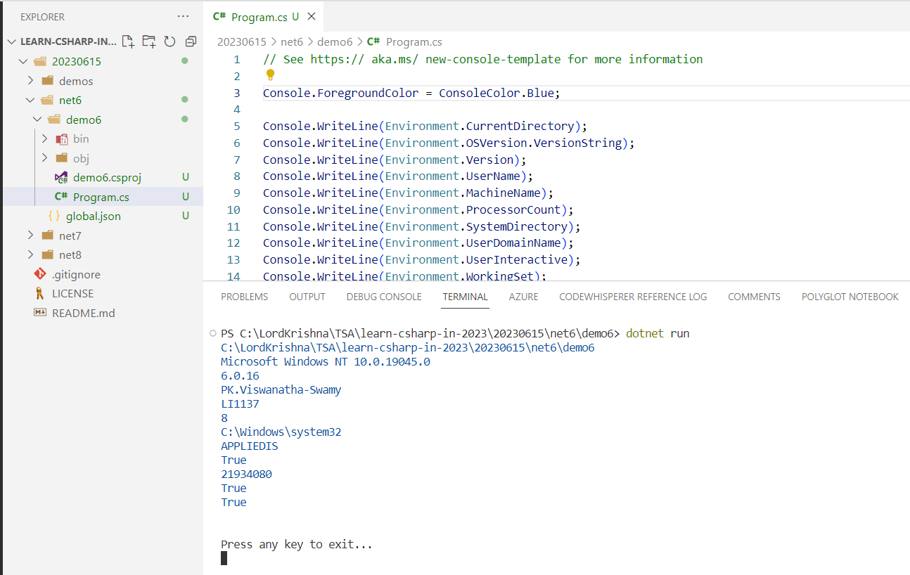

## 7. SUMMARY / RECAP / Q&A

> 1. Discussion and Demo

---

## 8. What is next ?

> 1. What is .NET?
> 1. .NET CLR basics
> 1. C# Language
> 1. Basic .NET CLI commands
> 1. Few Terms
> 1. `Global namespace imports` feature
> 1. `File-scoped namespaces` feature
> 1. Importing Namespaces
> 1. Workspace
> 1. Notification Icon
> 1. Multiple Projects
