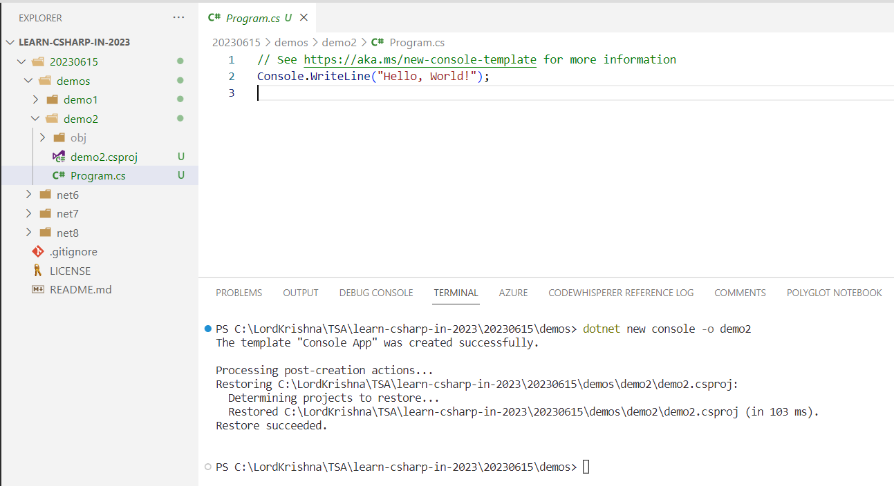
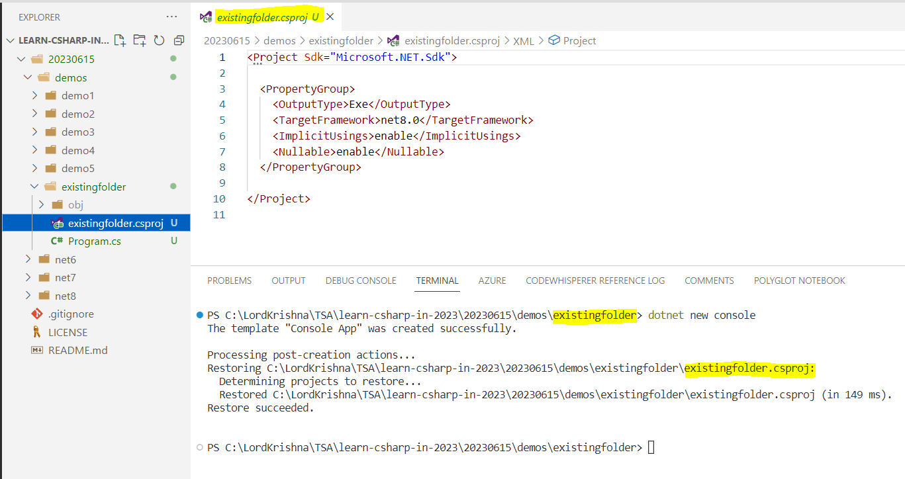
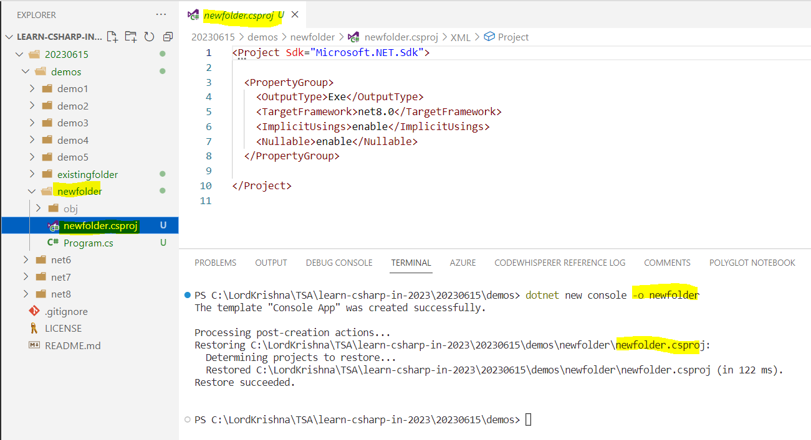
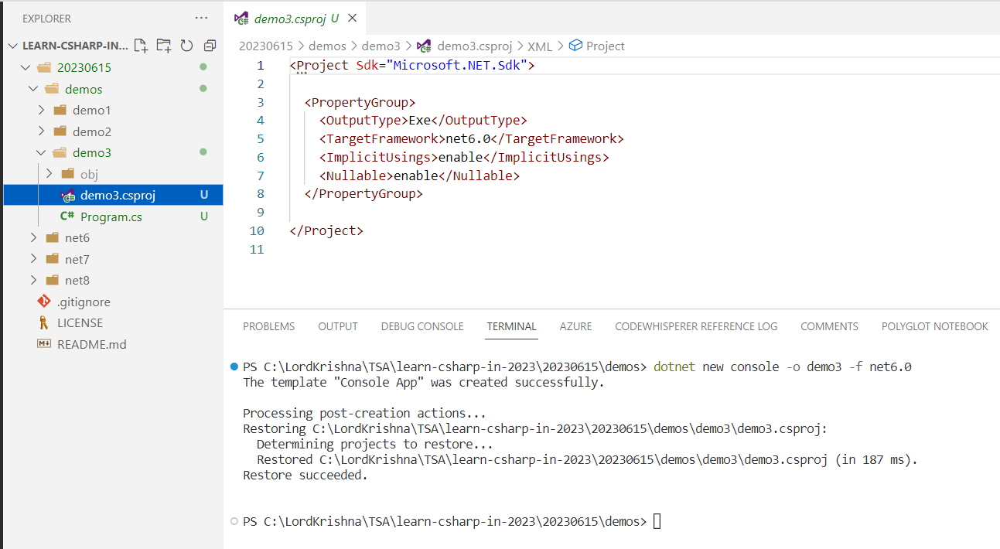
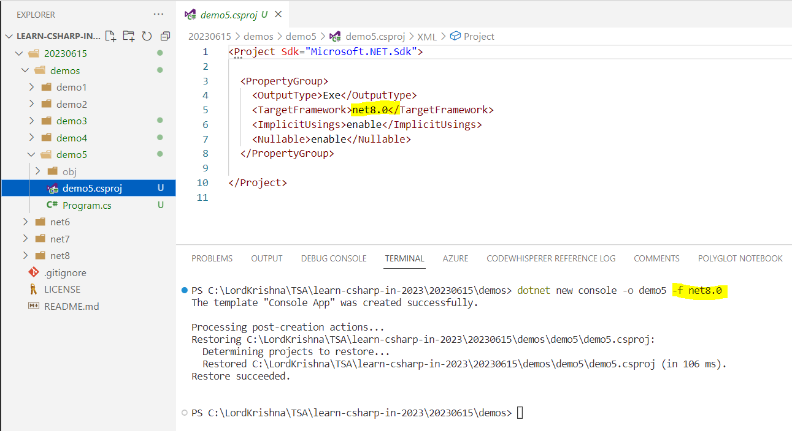
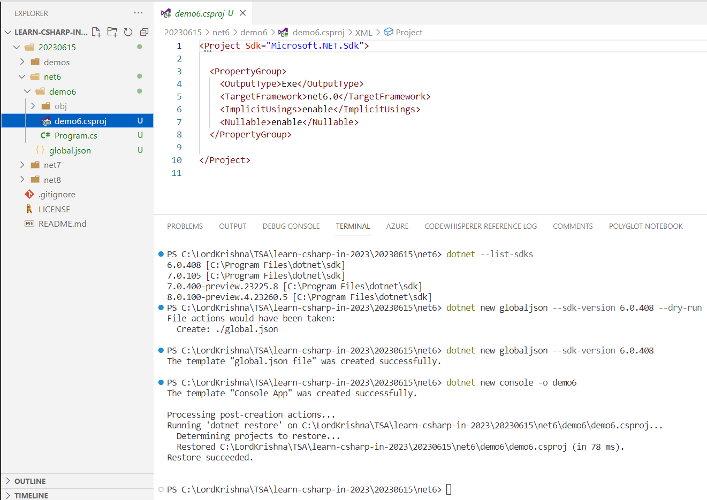
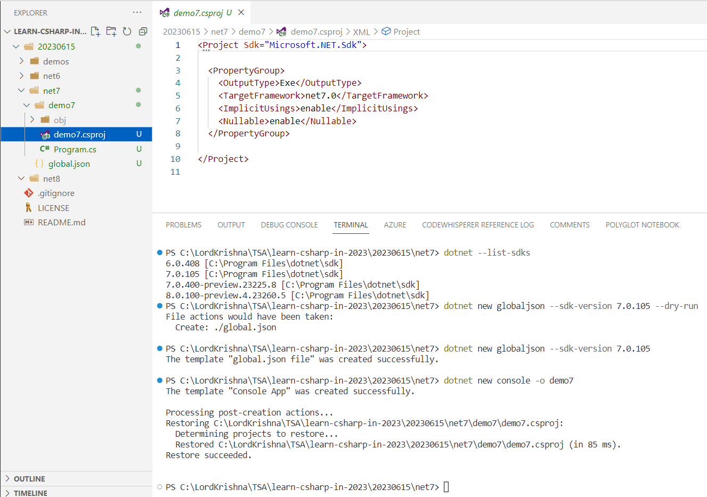
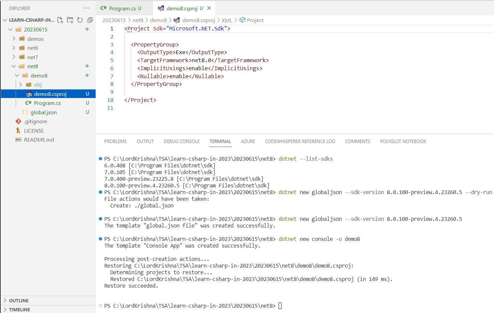

# Microservices series - Session 1

## Date: 15-Jun-2023

## Agenda for this session

> 1. Console Application with and without Top Level Programs
>    - 1.1 Without Top Level Programs
>    - 1.2 With Top Level Programs
> 2. Creating a Console Application within an `Existing` and `New` folder
>    - 2.1. Creating a Console Application within an existing folder
>    - 2.2. Creating a Console Application within a new folder
> 3. Creating a Console Application with .NET (6/7/8)
>    - 3.1. Creating a Console Application with .NET 6
>    - 3.2. Creating a Console Application with .NET 7
>    - 3.3. Creating a Console Application with .NET 8
> 4. Creating a Console Application with global.json inside folder
>    - 4.1. Creating a Console Application with .NET 6
>    - 4.2. Creating a Console Application with .NET 7
>    - 4.3. Creating a Console Application with .NET 8
> 5. Executing the Same Application in .NET 6/7/8
>    - 5.1. Sample C# Code
> 6. Implicit Usings file "global namespace imports" feature
> 7. SUMMARY / RECAP / Q&A
> 8. What is next ?

---

## 1. Console Application with and without Top Level Programs

> 1. Discussion and Demo

### 1.1 Without Top Level Programs

```bash
dotnet new console -o demo1 --use-program-main
```


### 1.2. With Top Level Programs

> 1. Top level Programs, with create `<Main>$()` method

```bash
dotnet new console -o demo2
```



## 2. Creating a Console Application within an `Existing` and `New` folder

> 1. Discussion and Demo

### 2.1. Creating a Console Application within an `Existing` folder

> 1. Create a folder `existingfolder`
> 2. Open `cmd` and navigate to `existingfolder`
> 3. Run the below command
> 4. This will create a console application within the `existingfolder`
> 5. It will name the console application as `existingfolder`

```bash
dotnet new console
```



### 2.2. Creating a Console Application within a `New` folder

> 1. Execute the below command
> 2. This will create a console application within the `newfolder`
> 3. It will name the console application as `newfolder`

```bash
dotnet new console -o newfolder
```



## 3. Creating a Console Application with different .NET (6/7/8)

> 1. Discussion and Demo

### 3.1. Creating a Console Application with different .NET 6

```bash
dotnet new console -o demo3 -f net6.0
```



### 3.2. Creating a Console Application with different .NET 7

```bash
dotnet new console -o demo4 -f net7.0
```


### 3.3. Creating a Console Application with different .NET 8

```bash
dotnet new console -o demo5 -f net8.0
```



## 4. Creating a Console Application with global.json inside folder

> 1. Discussion and Demo
> 1. Execute the below command

```bash
dotnet new list

dotnet new globaljson --help

dotnet --list-sdks
```

### 4.1. Creating a Console Application with different .NET 6

```bash
dotnet --list-sdks

dotnet new globaljson --sdk-version 6.0.408 --dry-run
dotnet new globaljson --sdk-version 6.0.408

dotnet new console -o demo6
```



### 4.2. Creating a Console Application with different .NET 7

```bash
dotnet --list-sdks

dotnet new globaljson --sdk-version 7.0.105 --dry-run
dotnet new globaljson --sdk-version 7.0.105

dotnet new console -o demo7
```



### 4.3. Creating a Console Application with different .NET 8

```bash
dotnet new console -o demo8 -f net8.0
```



## 5. Executing the Same Application in .NET 6/7/8

> 1. Discussion and Demo

### 5.1. Sample C# Code

```csharp
// See https:// aka.ms/ new-console-template for more information
Console.WriteLine(Environment.CurrentDirectory);
Console.WriteLine(Environment.OSVersion.VersionString);
Console.WriteLine(Environment.Version);
Console.WriteLine(Environment.UserName);
Console.WriteLine(Environment.MachineName);
Console.WriteLine(Environment.ProcessorCount);
Console.WriteLine(Environment.SystemDirectory);
Console.WriteLine(Environment.UserDomainName);
Console.WriteLine(Environment.UserInteractive);
Console.WriteLine(Environment.WorkingSet);
Console.WriteLine(Environment.Is64BitOperatingSystem);
Console.WriteLine(Environment.Is64BitProcess);
```

## 6. Implicit Usings file "global namespace imports" feature

> 1. Discussion and Demo

## 7. SUMMARY / RECAP / Q&A

> 1. Discussion and Demo

---

## 8. What is next ?

> 1. Workspace
> 1. Notification Icon
> 1. Multiple Projects
> 1. Debugging
> 1. And more...
